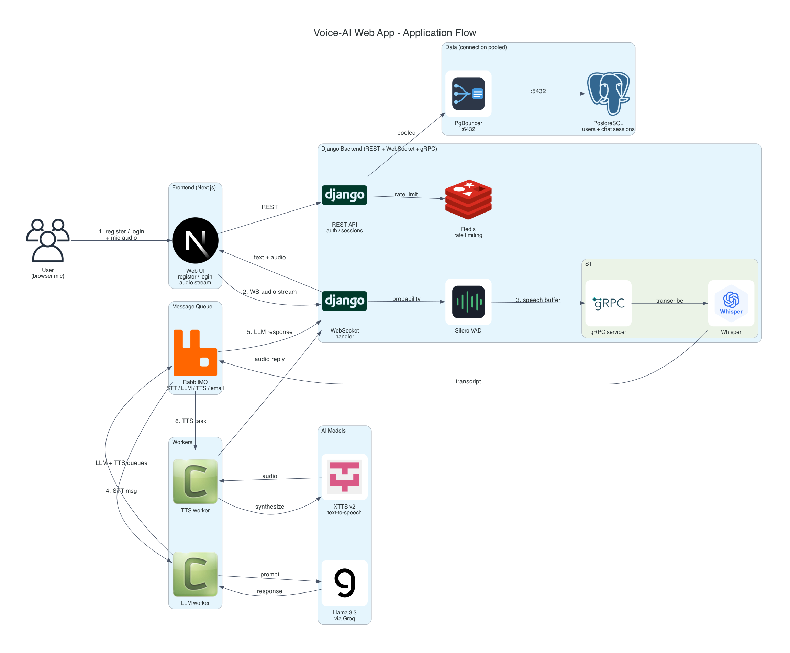
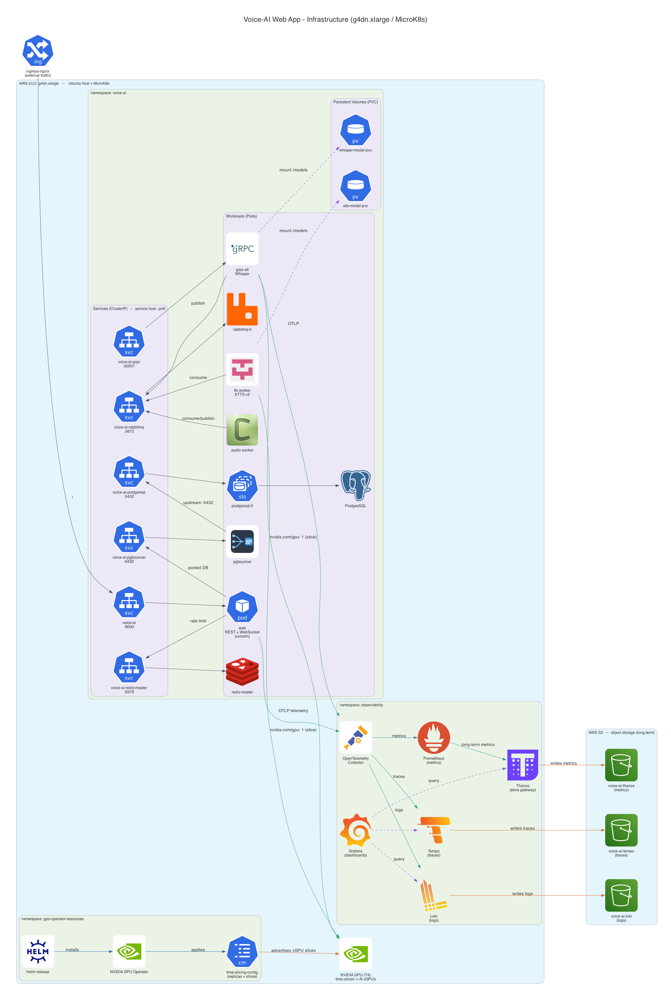

# Voice-AI-Web-App


## General Flow of the Web App:

1. User registers -> User login -> DB store via postgres

2. User speaks to the browser mic -> Websocket listens and process the audio -> Sends to Silero VAD evaluating the probability

3. Based on the threshold the audio buffer is passed to the gRPC servicer -> the servicer calls Whisper to Speech to Text Conversion -> The converted text is published to the RabbitMQ queue

4. The worker subscribed to the queue executes the logic by calling the LLM service -> the LLM service calls Meta Llama 3.3 verastile model and published the response to another RabbitMQ queue and to the TTS RabbitMQ queue

5. The websocket handler for handling LLM response subscribed to that queue gets the LLM response from the worker and sends it to the Frontend -> The Frontend displays the response

6. The task sent to the TTS worker is handled by the TTS service and the response is published to the websocket handler which then displays the audio response from the LLM text

### Application Flow Diagram:

The diagram below maps the flow explained above -> from the browser mic to the Silero VAD, the gRPC Whisper STT, the RabbitMQ queues, the LLM and TTS workers and finally back to the Frontend. It also shows Redis rate limiting the API and the DB connections being pooled through PgBouncer before hitting Postgres:



## Tech stack:

* **Django:** As the Backend Framework for defining the api endpoints for the REST server, configuring the REST server, Websocket server and the gRPC server for startup logic and graceful shutdown, setting variables for the RabbitMQ email worker to use and starting all three servers via the addition of uvicorn server

* **Whisper AI:** As the STT model for converting audio speech to text

* **Silero VAD:** As the AI model for speech detection based on the probability ensuring silence timeout and perfect speech detection

* **XTTS v2 encoder** As the Encoder for converting text to speech

* **Postgres:** Used as the DBMS for storing user credentials and token using the Django user model and for storing voice chat sessions

* **Pgbouncer**: Used as the connection pooler for connection pooling the live DB connections from the client

* **Next:** As the Frontend Framework for prompting the user to register or/and login with the mic audio streaming for sending the continious streams to the Backend

* **RabbitMQ:** Used as the Message Queue for sending email to the user after it registers, sending the audio converted to speech to the worker handler subscibing to the queue and for delivering the LLM response to the web socket LLM listener and the TTS worker response to the same listener

* **Redis:** Used for rate limiting the API requests to the Backend

* **Docker:** Used for containerizing the Web Application and for starting and running the DB, Message Queue and API rate limiter containers

* **Kubernetes** Used for orchestration of Infra pods and the application pods

* **Helm** Used for packaging the application with resuable infra Helm Charts(Postgres, RabbitMQ, Redis)

## Guidelines for starting with the web app

* **Configuration:** Create the .env file and Configure the GROQ API key for model based on your generated API key
* **pre-requisites:**

  * ensure the python interpeter version 3.11 or above is installed
  * ensure Docker is installed on the machine
  * ensure kind and kubectl is installed
  * ensure Helm is installed

* **Build the Docker image:**

  ```bash
  docker build -t voice-ai-web .
  ```
  
* **Starting the Backend server:** to start the Backend server follow these commands:

  ```bash
  cd voiceAI 
  ```
  ```bash
  chmod +x start.sh
  ./start.sh
  ```

* **Starting the Frontend server:** start the Frontend server by following these commands:

  ```bash
  cd frontend
  bun run dev
  ```

* **Running the Docker Containers:** Access the Docker Compose file and run the services seperately for creating and running the          Postgres,          Redis and RabbitMQ container.

  If you want to use the containerized Backend instead of starting the Backend from the terminal just follow this command

  ```bash
  docker compose up -d
  ```

* **Running on Kind Cluster:** 

    ```bash
    cd kind
    chmod +x ./create-cluster.sh
    ./create-cluster.sh
    ```

* **Deploying with Helm:**
  ```bash
  cd voice-ai-chart
  helm dependency build
  helm upgrade --install voice-ai ./ --namespace voice-ai --create-namespace
  ```

 ## Important Clarification

 As the XTTS model is heavy and resource intensive use on-premise GPU or a GPU based cloud VM instance such as the EC2 `g4dn.xlarge` instance or equivilant to another alternative cloud provider VM service

## Infrastructure Architecture:

The whole stack runs on a single GPU VM (EC2 `g4dn.xlarge` or equivilant) with MicroK8s and is packaged with Helm into a dedicated `voice-ai` namespace. The diagram below shows the infra level layout -> the Kubernetes namespaces, the services with their service host and port, the persistent volumes for the models and the GPU time-slicing driven by the NVIDIA Helm chart:



* **Kubernetes namespace:** everything is installed into a seperate `voice-ai` namespace via `--namespace voice-ai --create-namespace` so the app and the infra pods stay isolated in one release

* **Services (service host : port):** the pods talk to each other over ClusterIP services by name -> `voice-ai:8000` (web REST + WebSocket), `voice-ai-grpc:50051` (STT), `voice-ai-pgbouncer:6432` (pooler), `voice-ai-postgresql:5432`, `voice-ai-redis-master:6379` and `voice-ai-rabbitmq:5672`

* **Persistent Volumes:** the `whisper-model-pvc` and `xtts-model-pvc` PVCs persist the STT and TTS model weights so the gRPC and TTS pods dont re-download the heavy models on every restart

* **GPU time-slicing:** the NVIDIA GPU Operator is installed via its Helm chart and applies the `time-slicing-config` so the single physical GPU is advertised as multiple vGPU slices -> the STT (gRPC) and TTS pods each request `nvidia.com/gpu: 1` and share the one physical GPU instead of needing a card each

* **PgBouncer:** the app never connects to Postgres directly, the live DB connections are pooled through the `voice-ai-pgbouncer` service which then talks to the upstream `voice-ai-postgresql` on `:5432`

* **Observability:** the pods export OTLP telemetry to the OpenTelemetry Collector which fans it out by signal -> logs to Loki, traces to Tempo and metrics to Prometheus/Thanos. Each backend persists to its own S3 bucket (`voice-ai-loki`, `voice-ai-tempo`, `voice-ai-thanos`) and Grafana is used to query and visualize all three
